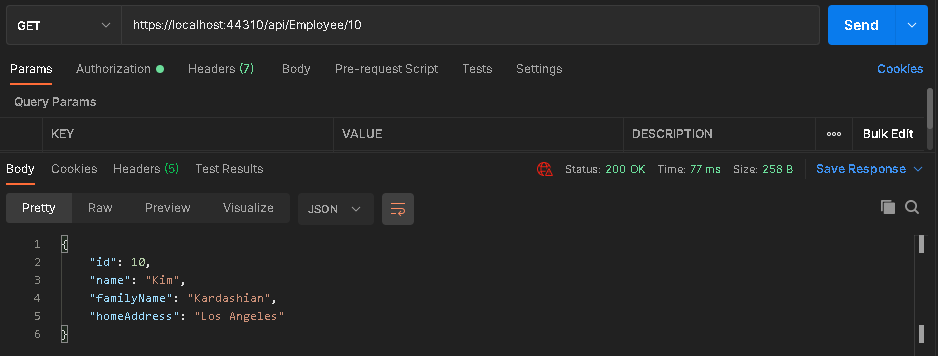
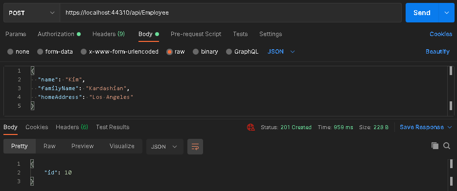
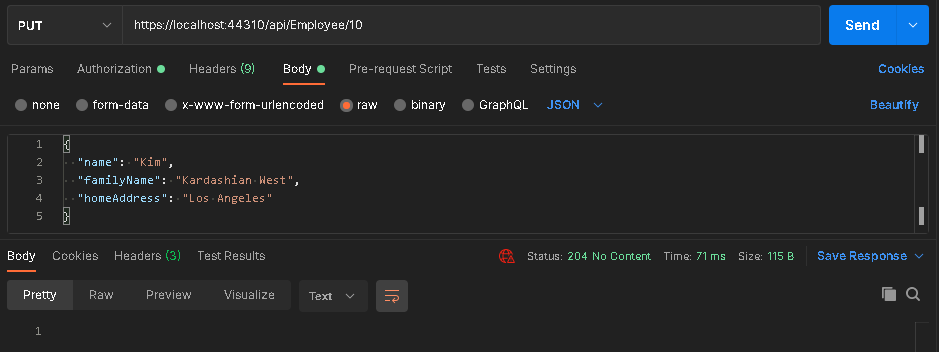
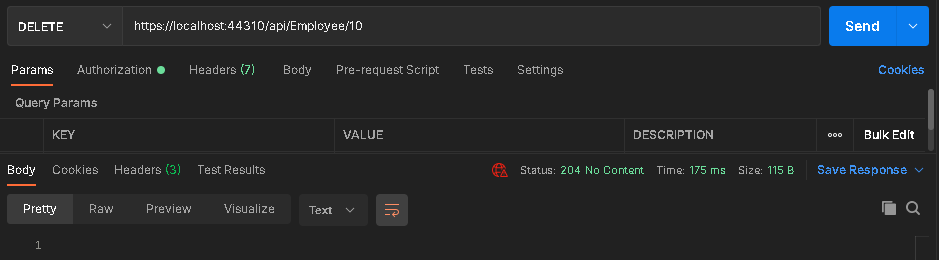
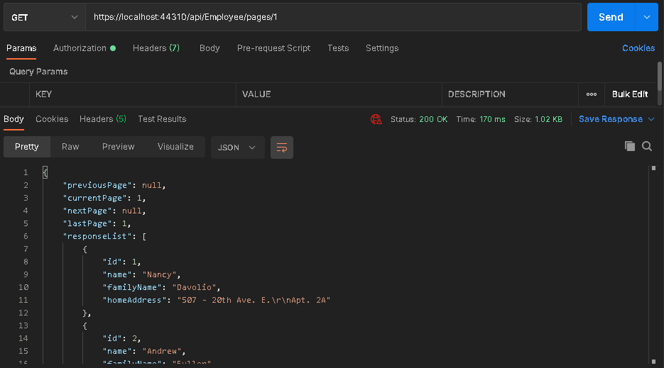
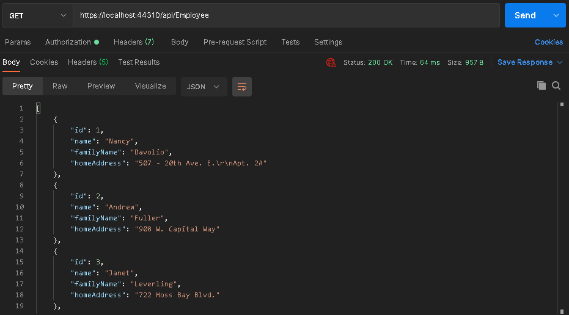

# Employee 👷‍♂️
El Controlador Employee permite a un usuario autenticado interactuar con la table Employees de la Base de Datos Northwind.

## ✔ Get One Employee

**Descripción**: Devuelve un JSON con la información del empleado solicitado.

**URL**: /api/Employee/{id}

**Método  HTTP**: GET

**Parámetros del URL**:
* **id**: Id del empleado solicitado. Número entero positivo.

**Parámetros del Body**: Ninguno

**Formato de Respuesta Satisfactoria**: Status 200

```typescript
{
	"id": number,
	"name": string,
	"familyName": string,
	"homeAddres": string
}
```

**Prueba**:



***

## ✔ Add Employee

**Descripción**: Agrega un registro de la tabla Employees con la información especificada en el Body. Devuelve un JSON con el ID registrado para el empleado.

**URL**: /api/Employee

**Método  HTTP**: POST

**Parámetros del URL**: Ninguno

**Parámetros del Body**:

```typescript
{
	"name": string,
      /*
      - Nombre del empleado.
      - String de 10 caracteres máximo.
      - Obligatorio.
      */

	"familyName": string,
      /*
      - Apellido del empleado.
      - String de 20 caracteres máximo.
      - Obligatorio.
      */

	"homeAddres": string
      /*
      - Dirección del empleado.
      - String de 60 caracteres máximo.
      - Opcional.
      */
}
```

**Formato de Respuesta Satisfactoria**: Status 201

```typescript
{
	"id": number
}
```

**Prueba**:



***

## ✔ Update Employee

**Descripción**: Modifica un registro de la tabla Employees con la información especificada en el Body.

**URL**: /api/Employee/{id}

**Método  HTTP**: PUT

**Parámetros del URL**:
* **id**: Id del empleado solicitado. Número entero positivo.

**Parámetros del Body**:

```typescript
{
	"name": string,
      /*
      - Nombre del empleado.
      - 10 caracteres máximo.
      - Obligatorio.
      */

	"familyName": string,
      /*
      - Apellido del empleado.
      - 20 caracteres máximo.
      - Obligatorio.
      */

	"homeAddres": string
      /*
      - Dirección del empleado.
      - 60 caracteres máximo.
      - Opcional.
      */
}
```

**Formato de Respuesta Satisfactoria**: Status 204

**Prueba**:



***

## ✔ Delete Employee

**Descripción**: Elimina el registro del empleado especificado.

**URL**: /api/Employee/{id}

**Método  HTTP**: DELETE

**Parámetros del URL**:
* **id**: Id del empleado solicitado. Número entero positivo.

**Parámetros del Body**: Ninguno

**Formato de Respuesta Satisfactoria**: Status 204

**Prueba**:



***

## ✔ Get Page

**Descripción**: Devuelve un JSON con 10 registros de la tabla de empleados. Los registros que se muestren dependerán de la página solicitada.

**URL**: /api/Employee/pages/{requestedPage}

**Método  HTTP**: GET

**Parámetros del URL**:
* **requestedPage**: Número de la página que se desea obtener de la tabla de empleados. Número entero positivo.

**Parámetros del Body**: Ninguno

**Formato de Respuesta Satisfactoria**: Status 200

```typescript
{
	"previousPage":  number | null,
	"currentPage":  number | null,
	"nextPage":  number | null,
	"lastPage":  number,
	"responseList":  [
		{
			"id": number,
			"name": string,
			"familyName": string,
			"homeAddres": string
		},
		//...
	]
}
```

**Prueba**:



***

### ✔ Get All Employees

**Descripción**: Devuelve un JSON con todos los registros de la tabla de empleados. Los registros que se muestren dependerán de la página solicitada.

**URL**: /api/Employee/pages/{requestedPage}

**Método  HTTP**: GET

**Parámetros del URL**:
* **requestedPage**: Número de la página que se desea obtener de la tabla de empleados. Número entero positivo.

**Parámetros del Body**: Ninguno

**Formato de Respuesta Satisfactoria**: Status 200

```typescript
{
	[
		{
			"id": number,
			"name": string,
			"familyName": string,
			"homeAddres": string
		},
		//...
	]
}
```

**Prueba**:

