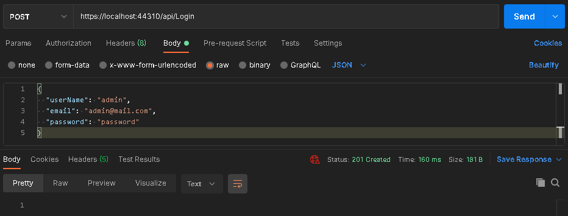

# Login 🔐
El Controlador Login se utiliza para iniciar sesión y dar de alta a usuarios que estén autorizados para utilizar el resto de controladores de la API.

## ✔ Login

**Descripción**: En caso de que el usuario y la contraseña correspondan a un registro válido de la tabla Users en Northwind, devuelve un token que puede ser utilizado para hacer peticiones al resto de endpoints de la aplicación.

**URL**: /api/Login

**Método  HTTP**: GET

**Parámetros del URL**:
* **username**: Nombre de Usuario. String de 30 caracteres máximo.
* **password**: Contraseña del Usuario. String sin límite de caracteres.

**Parámetros del Body**: Ninguno

**Formato de Respuesta Satisfactoria**: Status 200

```typescript
{
	"token": string
}
```

**Prueba**:



***

## ✔ Signup

**Descripción**: Agrega un registro a la tabla de Usuarios.

**URL**: /api/Login

**Método  HTTP**: POST

**Parámetros del URL**: Ninguno

**Parámetros del Body**:

```typescript
{
	"username": string,
      /*
      - Nombre de Usuario.
      - 30 caracteres máximo.
      - Debe ser único.
      - Obligatorio.
      */

	"email": string,
      /*
      - Correo de Usuario.
      - 30 caracteres máximo.
      - Debe ser único.
      - Obligatorio.
      */

	"password": string
      /*
      - Contraseña del Usuario.
      - String sin límite de caracteres.
      - Obligatorio.
      */
}
```

**Formato de Respuesta Satisfactoria**: Status 201

**Prueba**:


# [Volver](../README.md) ⏪