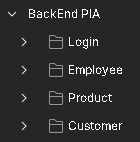

# Programación Web BackEnd - PIA
En este repositorio se encuentran los archivos correspondientes al PIA de Programación Web - BackEnd del grupo 31 la Facultad de Ciencias Físico Matemáticas.


## Integrantes✒️
* **José Santos Flores Silva** -  [josflores19](https://github.com/josflores19)
* **Edson Yael García Fuentes** - [Yael2407](https://github.com/Yael2407)
* **Sofía Alejandra Gaytán Díaz** - [SouAle](https://github.com/SouAle)
* **Ángel Tejeda Tiscareño** - [AngelTejeda](https://github.com/AngelTejeda)


## Proyecto Deployado ☁
* Si desea probar la Aplicación FrontEnd deployada en Azure, diríjase a este [link]().
* Si desea realizar peticiones a la API deployada en Azure, diríjase a este [link]().

## Descarga y Configuración 🔨
A continuación se muestran los pasos a seguir para obtener una copia del repositorio y echarlo a andar en el localhost de su máquina local.

### Pre-requisitos 📋
#### Para el FrontEnd 📱
* Node Package Manager.
* Angular
* Ionic.

#### Para el BackEnd 🔙
* Microsoft Visual Studio Community
* Runtime de .NET 5
* Microsoft SQL Server Manager

### Descarga ⬇
Hay muchas maneras de descargar el repositorio a su equipo, explicaremos la forma de hacerlo a través de Git Bash, pero puede utilizar la opción que más le agrade.

Si ya cuenta con Git Bash, diríjase a la carpeta donde desea clonar el repositorio. Si da click derecho en esta carpeta verá la opción `Git Bash Here`. Al seleccionarla se abrirá una terminal. En ella introduzca el siguiente comando

```
git clone https://github.com/AngelTejeda/Backend-PIA
```

Se empezarán a descargar los archivos del proyecto a su equipo local. Una vez se terminen de descargar puede cerrar la ventana.

### Configuración 🔧
Para poder echar a andar el proyecto de manera local es necesario seguir los pasos que se muestran a continuación.

#### Configuración de la Base de Datos 🗃️
Este proyecto utiliza una versión ligeramente modificada de la Base de Datos `Northwind`.

Una vez haya clonado el proyecto a su equipo, diríjase a la carpeta `SQL Files`. En ella encontrará los archivos `Custom Northwind.sql` y `Original Northwind.sql`. Abra el primer archivo en Microsoft SQL Server Manager y ejecútelo. Esto eliminará la Base de Datos Northwind (si la tiene) y creará la Base de Datos necesaria para ejecutar este proyecto. Si desea restaurar la Base de Datos original, puede ejecutar el segundo archivo.

***

#### Configuración de la API ☁
Diríjase a la carpeta `BackEnd` y abra el archivo `PIA.sln` en Microsoft Visual Studio. En el panel `Solution Explorer` podrá ver los archivos de la solución.

En el proyecto `Core` verá el archivo `connections.json` con la siguiente estructura:
```json
{
  "ConnectionStrings": {
    "NorthwindDatabase": "Server=<SERVER>; Database=Northwind; Trusted_Connection=True;"
  }
}
```

Sustituya `<SERVER>` por el nombre de su servidor de SQL Server donde creó la Base de Datos Northwind.

Ahora dé click derecho al proyecto `API Rest` y seleccione la opción `Set as Startup Project`.

Nuevamente dé click derecho al proyecto, dentro del menú en la opción `Add` seleccione `Project Reference`. En la ventana que se muestra marque la casilla del proyecto `Core` y seleccione `Ok`.

Una vez hecho esto ejecute la aplicación dando click en en el botón `▶IIS Express` o presionando la tecla `f5`.  Una nueva ventana en su navegador debería abrirse en la dirección `https://localhost:44310/swagger/index.html`. Verifique que el puerto en el que se está ejecutando sea el `44310`.

***

#### Configuración de la Aplicación Front End 📱
El repositorio no incluye los módulos necesarios para ejecutar la aplicación. Para instalarlos en el proyecto abra la carpeta `FrontEnd` que se encuentra dentro del proyecto que clonó de este repositorio. En esta dirección abre una terminal y ejecute el siguiente comando

```
npm i
```

Una vez se terminen de descargar e instalar los módulos correspondientes, ejecute la aplicación mediante el comando que se muestra a continuación

```
ionic serve
```

Cuando el proyecto termine de compilarse se abrirá una nueva pestaña en el navegador en la ruta `http://localhost:8100/tabs/home-tab`.  Verifique que el puerto en el que se ejecuta la aplicación sea el `8100`.

Con esto ya podrá interactuar con la Base de Datos Northwind local a través de la API que es consumida por la aplicación del FrontEnd.


## Pruebas de los Endpoints en Postman 📧
Para probar los endpoints de la API en Postman desde el localhost, importe el archivo `Postman Endpoint Collections.json`. Deberá agregarse una colección con el nombre `BackEnd PIA`.

Dentro de esta carpeta se encontrarán a su vez 4 carpetas, uno para cada controlador de la API.



Para probar los endpoints en Postman primero es necesario ejecutar el POST del controlador Login para generar un usuario. Con los datos ingresados se debe ejecutar el GET del mismo controlador para obtener un token de acceso. Este token se guarda automáticamente en las variables de entorno y se utiliza para mandar llamar al resto de endpoints de la API, por lo que no necesita preocuparse por copiar el token en cada request.

Puede encontrar información más detallada de los endpoints en [este archivo](./Markdown/ENDPOINTS.md).